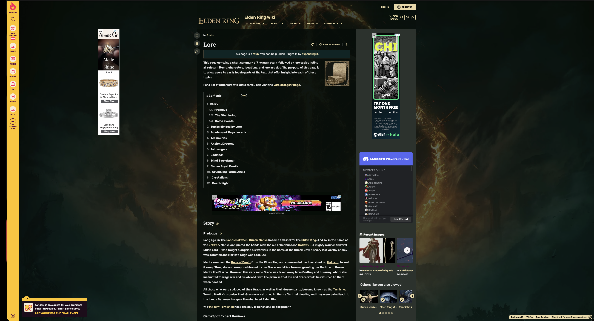
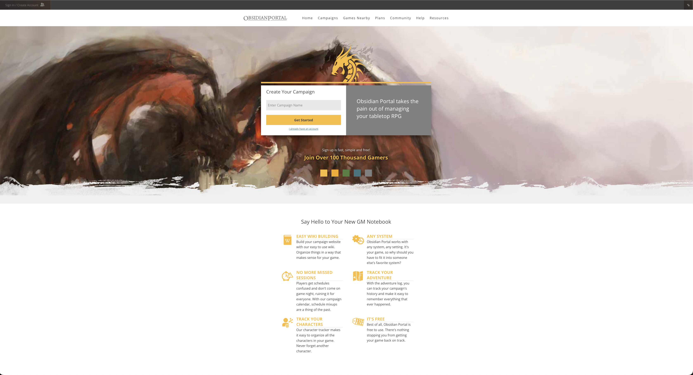
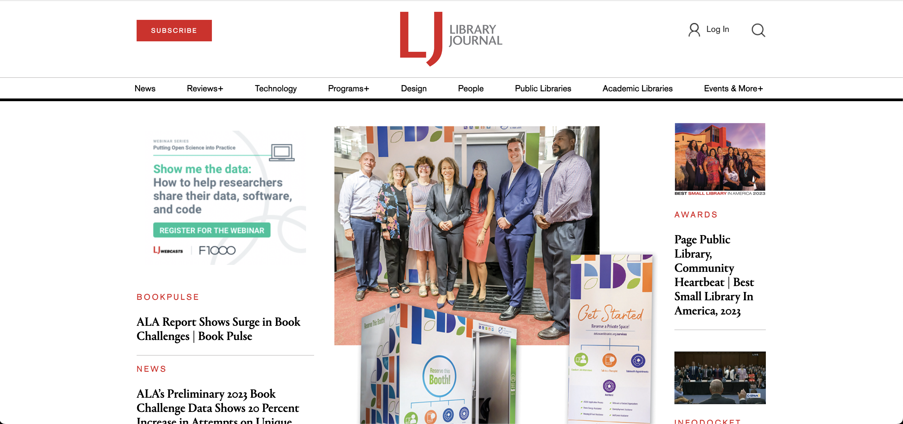
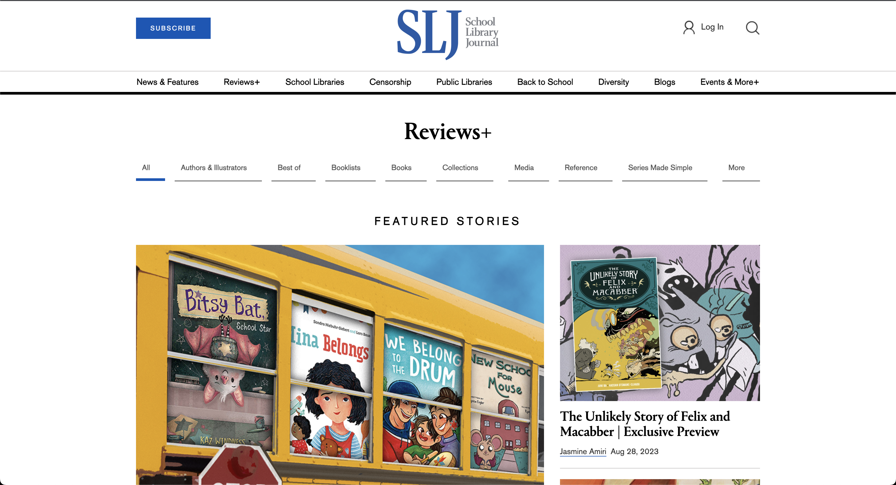
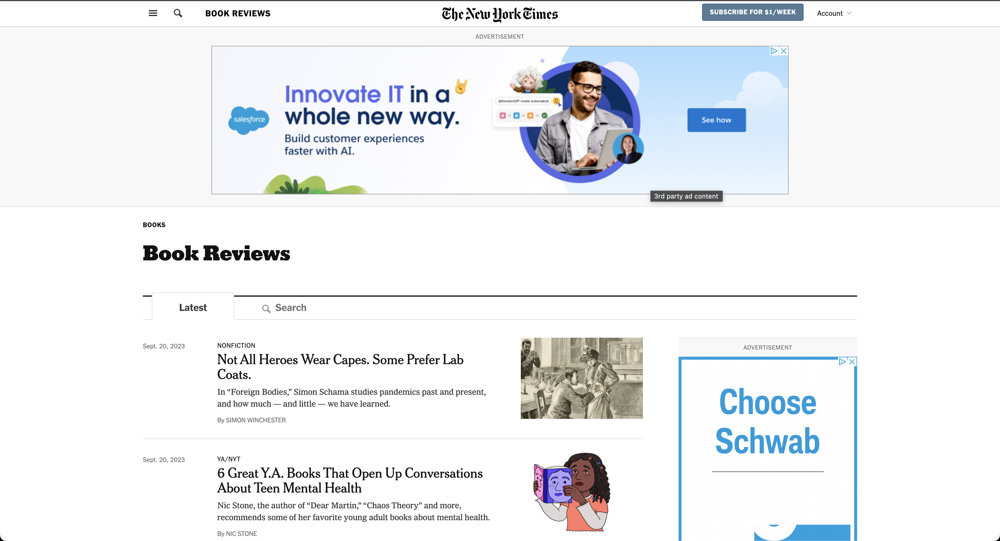

# Project 1: Design Journey

**For each milestone, complete only the sections that are labeled with that milestone.** Refine all sections before the final submission.

You are graded on your design process. If you later need to update your plan, **do not delete the original plan, leave it in place and append your new plan _below_ the original.** Then explain why you are changing your plan. Any time you update your plan, you're documenting your design process!

**Replace ALL _TODOs_ with your work.** (There should be no TODOs in the final submission.)

Be clear and concise in your writing. Bullets points are encouraged.

**Everything, including images, must be visible in _Markdown: Open Preview_.** If it's not visible in the Markdown preview, then we can't grade it. We also can't give you partial credit either. **Please make sure your design journey should is easy to read for the grader;** in Markdown preview the question _and_ answer should have a blank line between them.

## Markdown Instructions

## Personal Site (Milestone 1)

### Website Topic (Milestone 1)

OLD answer:
> database of lore on Fromsoftware's Dark souls series of video games. These games possess deep complicated pantheons of gods and monsters. Each page will be a different entry in the series with sections for characters, timelines, and landmark events.

NEW answer:
> My website will be a personal diary of books that I have read recently. The site will focus on historical fiction, and the select few genres that I have the strongest connection to: classical literature, gothic horror, epic poetry, and medieval fantasy

## Personal Website Design Exploration (Milestone 1)

Identify three personal websites (preferably static websites) that exist today on the web. You will be drawing inspiration from these sites for your own site; please select websites that are similar to the website you wish to create.

Include a screenshot of the home page for each site. If you're planning a mobile website, your screenshots should be from a mobile website. If you're planning a desktop website, your screenshots should be from a desktop website.

**We'll refer to these are your "example websites."**

> OLD answers:

1. <https://eldenring.fandom.com/wiki/Lore>

    

2. <https://www.obsidianportal.com/>

    

3. <https://darksouls.wiki.fextralife.com/Lore>

    

> NEW answers:

1. https://www.libraryjournal.com/

    

2. https://www.slj.com/section/reviews

    

3. https://www.nytimes.com/topic/subject/book-reviews

    

### Personal Website 1 Review (Milestone 1)

> OLD answer:
> This site is designed for young men and women, approximately 13 and up, as that is the game's intended audience. The audience's goals when visiting this site are likely to answer a question relating to the game's story and lore. The game this site explains is vast and has many easy-to-miss characters and storylines. This site has maps, images, art pieces, bodies of text, and timelines. This site addresses the audience's goals by providing a wide range of information regarding the game. The design is relatively simple, and although I am not too fond of the ads and side menu, the information sections are neatly organized in an order that I find convenient. The site is designed for both desktop and mobile devices.

> NEW answer:
> This site is created for a professional audience in the library and literary field. The primary goal of the audience visiting this site is to stay updated with the latest news, book reviews, and literary insight. The website offers a variety of resources including book reviews, editorials, and information on upcoming events and professional development programs. It features sections like "Industry News", "Book Pulse", and "Innovation", providing an informative source that caters to the interests of its audience. The site is well-organized with different clearly marked sections, making navigation convenient. Although the site has sponsored content and a considerable amount of ads, it maintains a structured layout that facilitates easy access to its various topics. The website is accessible on both desktop and mobile devices, ensuring that users search its database away from home.

### Personal Website 2 Review (Milestone 1)

>OLD answer:
> The intended audience of this site is dungeon masters of dungeons and dragons, which tend to be older adolescents, young adults, and adults. When visiting this site, people generally aim to streamline their Dungeons and Dragons campaign. This site makes running the game much more fun for the DM and players. This site includes large images, text, and a large map. The content of this website addresses the goals of the audience. What I like about the design of this site is the main page. It includes a large background image and a prompt to jump right into the campaign manager, while the menu at the top is easily navigatable. This site is designed primarily for desktops, although it does work on mobile.

> NEW answer
>This is a site for educators and librarians. Visitors to this site are likely seeking reviews on a diverse range of books for younger audiences, including graphic novels, picture books, and young adult series. This site is extensive, featuring a rich array of articles, blogs, and reviews. This site facilitates the audience's search by offering a comprehensive collection of resources, including featured stories, author interviews, and category-specific filters for a concise browsing experience. Although the presence of numerous articles and options might seem overwhelming to some, the design is straightforward, with a clear categorization of sections. The information sections are well organized, and allow for convenient navigation. This site is optimized for both wide and narrow screens, ensuring a seamless browsing experience regardless of the platform used.

### Personal Website 3 Review (Milestone 1)
> OLD answer:
> The intended audience for this site is, once again, young adults. The audience of this site is those looking for guides on gameplay mechanics, story moments, and character quests. This site contains game guides and information regarding the narrative and game lore. This website presents large bodies of information and a plethora of maps detailing in-game locations; the content of this site brings everything from this huge game into one place, addressing the audience's goals; answering any question about the story and lore becomes exceptionally convenient. The menus of this site include icons straight from the game, making navigation easily understandable for the intended audience. The colors and organization are also reminiscent of the in-game menus. This website is designed for both desktop computers and mobile devices.

> NEW answer:
> This site is a hub for literary enthusiasts and readers of various genres, ranging from non-fiction to poetry and fiction. The audience visiting this site seeks to delve into reviews and analyses of recent publications. The platform this site presents is extensive, boasting a vast array of articles that discuss various facets of the literary world. This site meets the audience's objectives by offering a repository of information on a wide array of topics, ranging from contemporary societal issues in non-fiction pieces to the creativity explored in fiction and poetry. The design is straightforward, with a clear categorization of pages, which facilitates quick navigation despite the dense content. The information sections are organized, allowing users to seamlessly explore reviews based on their preferences. This site is optimized for wide and narrow screens, increasing accessibility.

## Audience & Goals (Milestone 1)

Using what you learned from studying the example websites, identify your website's audience and their goals.

### Audience (Milestone 1)

> OLD answer:
> The audience for my site would be young adults. Young adults are the primary audience of the games featured on the site. I will target specifically those who wish to explore specifically the narrative, lore, and characters, as I will leave out anything related to gameplay mechanics and guides.

> NEW answer:
> The audience for my site are literary enthusiests who enjoy genres relating to historical fiction. I will specifically cater the site to those who wish to dive deeper into the books that I have read, and encourage them to utilize my site to inform their reading decisions.

### Audience Goals (Milestone 1)

> OLD answer:

1. learning about the games' lore to make an educated purchasing descision
2. Finding inspiration for writing and worldbuilding
3. clarifying vague aspects of the game's characters and story

> NEW answer:

1. Looking for a new book to read in a specific genre
2. Gathering others' opinions about a particular book
3. Skimming a quick summary, review, and author information before starting a prospective read

## Content Planning (Milestone 1)

Plan your site's content.

### Your Site's Planned Content (Milestone 1)

> OLD answer:

- text
- character images
- location images
- artifact images

> NEW answer:

- summary, author information, and reviews for the following books
  - Dracula
  - Frankenstein
  - The strange case of Dr. Jekyll and Mr. Hyde
  - The Odyssey
  - Dante's Inferno
  - Beowulf
  - The Lord of the Rings
  - The Eye of the World
  - The Count of Monte Cristo
  - The Three Musketeers
  - The Great Gatsby
- An image of the Author for each book
- A list for currently reading books
- An "about me" text
  - contact information (for book recs)
- A welcome text
- small informative icons

### Content Justification (Milestone 1)

> OLD answer:
> A website that provides a surplus of information about such an expansive piece of fiction requires images to accompany the often difficult-to-remember names. An individual may not remember a name, but they may remember the face, artifact, or location it belongs to. On the other hand, a user may want to find a specific character, place, or artifact to look for in a game, and providing an image alongside a name and description helps them achieve their goal more effectively.

> NEW answer:
> Incorporating a range of content such as summaries, author information, and reviews for a close selection of personal favorite literary works, my book review website strives to be a comprehensive resource for book enthusiasts. The inclusion of author images and a "currently reading" list adds a personal touch, which aims to foster a community of like-minded readers. Additionally, the "about me" section with contact information encourages interaction and book recommendations, while the welcome text and informative icons ensure a user-friendly experience. Which makes my website a welcoming and engaging space for literary exploration.

### Home Page Content (Milestone 1)

>OLD answer:
> The homepage will include a text description and a short synopsis of the game world. I will include a large image to associate with the text. When the user enters the site, they should be instantly provided with a brief introduction to know if they are in the right place, and if so, they can be conveniently brought closer to their goal. To some, a brief introduction may be all they need. I will include a menu to navigate the site's various pages, and icons will accompany the labels for a more aesthetically pleasing experience. The menu will be easily read and placed conveniently on the page to provide the user with the most accessible way to find the required information.

> NEW answer:
>The homepage of my personal book review website will feature a welcome text that serves as a brief introduction to the site, informing visitors of my mission. To facilitate easy navigation, the homepage will also incorporate a well-placed menu with a small informative icon accompanying the labels, enhancing the aesthetic appeal and accessibility of the site. The "currently reading" list will be prominently displayed in the middle, offering visitors a glimpse into my current literary explorations and possibly encouraging them to delve deeper into my site for more detailed reviews and information. The "about me" section and contact information for book recommendations, will be accessible through the homepage, fostering a community of engaged readers and encouraging interaction.

## Information Architecture (Milestone 2)

For milestone 2, you will design the information architecture for all the pages your website.

You may change your homepage content based on your card sorting. If you do change the homepage content, don't update it above, just include the new plan in the section below (Content Organization).

### Content Organization (Milestone 2)
> Document your **iterations** of card sorting here. You must have at least 2 iterations of card sorting.
> Include photographic evidence of each iteration of card sorting **and** description of your thought process for each iteration.
> Please physically sort cards; please don't try and do this digitally.

> iteration 1
    
> Here, I organized the book content based on book genre.

> iteration 2
    
> Here, I organized book content based on the story elements of the content: fantastical, occult, and realistic

### Final Content Organization (Milestone 2)
> Which iteration of card sorting will you use for your website?
> I will use iteration 1

> Explain how the final organization of content is appropriate for your site's audiences.

> Organizing books into genres is the most accurate way to catagorize them. Grouping the content into arbitrary catagories based on the plot or themes is unpreductive and would cause more confusion than it would inhibit. Seperating the overarching theme: historical fiction, into more concise groups based on genre provides the user with the most efficient route to their goal.

### Navigation (Milestone 2)
> Please list the pages you will include in your website's navigation.

- Medieval Fantasy
- Classical
- Gothic Horror
- Epic Poems
- Homepage

> Explain why the names of these pages make sense for your site's audience.

> Naming the navigation pages after book genres included in the site allows the user to easily search for information about a book in the particular genre that most aligns with their goals. All content is geared towards the historically inclined reader, but breaking down that catagory streamlines the experience of searching for content in my site, thus making it more accessable. Additionally the inclusion of more catagories accounts for the familiarity of the user as some users may not know what a given catagory means.

## Visual Themes (Milestone 3)

**Make the case for your decisions using concepts from class, as well as other design principles, theories, examples, and cases from outside of class.**

Remember to focus on the things we can't see just by looking at the site: changes, alternatives considered, processes, and justifications.

Each section is probably around 1 reasonably sized paragraph (2-4 sentences).

### Theme Ideas (Milestone 3)
> Discuss several (more than two) ideas about styling your site's theme. Explain why the theme ideas are appropriate for your target audiences.

1. theme 1

   - Color - Navy, contrasted by a light grey text
   - Shape - text will be seperated by lines and bodies of text will be in angular shapes to distinguish different sections of the site
   - Typography - strong, bold, Professional font
   - Imagery - All pictures will have hard edges and have a dark border bright icons near the menu

2. theme 2

   - Color - Off white background with dark text
   - Shape - text will be seperated by large underlined headings and will sit on the background without being boxed off
   - Typography - dark, thin, stylish text
   - Imagery - images will have dark borders to help them stick out from the background large icons to draw attention to interactive segments

3. theme 3

   - Color - off white and blue
   - Shape - softer shapes and soft seperation lines between significant sections
   - Typography - readable professional typeface
   - Imagery - images will not have borders and will have rounded edges there will be small minimalist logos and icons

### Final Theme (Milestone 3)
> Which theme did you select as your final theme? Why?

> I chose a minimalist theme characterized by a navy background and off-white text boxes to align with the mature preferences of my target audience, who I intend to be aficionados of more advanced literature. The theme that I chose for the site is reflected in the matuer tone that the theme invokes, which displays the reading taste and goals of the audience.

### Theme Rationale (Milestone 3)
> Discuss your final theme design: how do they fit your overall design goals and audiences?

> The topic of the site is advanced historical literature, therefore the site is intend for an older audience who do not need bright saturated colors and large icons. This theme will bolster the asthetic of the site and fits with the tone of the books presented. The theme, with its uniform color palette and professional fonts, mirrors the themes of the genres of texts that I included, offering a tranquil and dignified space that should resonate well with an older, more scholarly audience.

> Emotion is a big part of design. What emotions were you thinking about or trying to convey in your designs?

> The design aims to evoke a sense of calm, professionalism, and intellectual curiosity. I plan to keep the user calm by not bombarding them with an overuse of imagery and meaningless text. I will retain a sense of proffessionalism in my chosen font, colorscheme, and formatting. Although there is a large quantity oftext on the site. I intend to encourage users to immerse themselves in deep, thoughtful explorations of the historical fiction presented on the site.

## Composition (Final Submission)

### Home Page Composition (Final Submission)
> Include at least two sketches of possible composition ideas for the home page.
> Provide an explanation for each sketch explaining the idea.
> Show your design process.
> **Use the example websites above as inspiration for your site's design.**

### Final Site Design (Final Submission)
> Include a sketch of the final composition for each page in your site.
> Provide an explanation below each sketch.

TODO: site sketches

### Static Website Design Check (Final Submission)
> We're building a static website without interactivity.
> **No part of your website may dynamically change.**
> Examples of dynamic behavior are dropdown menus, hamburger menus, popups, modals/lightboxes, image carousels, etc.
>dfd
> Audit your design and check that you aren't relying on any dynamic features.

> There is no interactivity on my wesite because there is no Javascript implementation. Without javascript, my mobile website will load faster on user's devices and page navigation will appear more seamless, simultaniously, a lack of Javascript will also limit some of the errors that may occur on a website such as broken images.

## Rationale (Final Submission)

**This rationale should be polished writing:** one you might submit as a report to a client or boss to help explain the project and convince them you did a good job. You'll be surprised how much writing and communicating you need to do about projects and choices on internships and jobs; practice that here.

It should be a comprehensive, complete story of the project. You might find that each section runs a few paragraphs (1-2). Sketches can often help tell the story of your design. Screenshots are also useful for describing issues discovered during the design process and how you addressed them.

**All images must be visible in "Markdown: Open Preview" for credit!**

Your rationale should be a polished version of the earlier explanations.

### Audience (Final Submission)
> A complete and polished description of the intended audience(s) for your website.

TODO: audience rationale

### Design Goals (Final Submission)
> An explanation of the design goals for that audience, based on your earlier rationales.

TODO: your design goals

### Content Organization & Navigation (Final Submission)
> An explanation of how the final content organization and navigation met your goals and why it's appropriate for your audience.

TODO: content and information architecture rationale
> While retaining the premise of a personal website, I attempted to keep most of the information I presented about each book objective and displayed in an informative organized manner. My review of each book is subjective, and the rating I attached to each work should be the last thing the user sees in each book section so that the user has the option to form their own opinions first, then return to compare it with mine. The navigation of the site fits in line with my goals as it allows the user to browse the site's content in the most commonly accessable manner; navigating the site based on book genre accounts for the possibility that not all users will know every genre included in the site.

### Visual Design (Final Submission)
> An explanation of how the final design met your goals and why it's appropriate for your audience.

> I strived to create a website that combines my passion for reading with my interest in history. Based on these interests, my audience will be more proffessionally inclined and compositionally advanced. Therefore, the theme for my site best suits my audience as it features little embelishment or the overuse of imagery. The photos I included are informative, the font is professional and readable, and the color combination of navy blue and off white reinforces this polished look as it is common in a buisness setting.

### Self-Reflection (Final Submission)
> Take some time here to reflect on how much you've learned since you started this class. It's often easy to ignore our own progress. Take a moment and think about your accomplishments in this class. Hopefully you'll recognize that you've accomplished a lot and that you should be very proud of those accomplishments!

> Prior to this Class, I already had an intermediate understanding of how HTML worked and how to impliment it to make a basic website. I found learning how CSS works and how to impliment styling with it was extremely enjoyable. I am surprised at my progress as it usually takes significantly more time for me to learn a coding language. Using CSS was very engrossing; during the milestone 3 process, I spent much longer than I should have examining my design theme and finding ways to impliment it. The feeling of finding a solution to "why isn't this working" always makes the time spend worth it.
> The theory behind the design decisions is interesting, and I found that the concepts taught during lecture assimilate well with the design principles I have read in Norman's "Design of Every Day Things". In designing my website, I attempted to keep those design principles in mind, and combine them with the more specific website development conventions from lecture.

## Grading (Final Submission)

### Grading: Open the Design Journey in Markdown: Open Preview (Final Submission)
> Preview your design journey in VS Code. Please verify that this document is easy to read/grade.
>
> - Remove all _TODOs_
> - All images must be visible.
> - All images must be oriented the correct way.
> - There should be a blank line between the question prompt and your answer.
>
> Is your design journey easy to read?

> Yes

### Collaborators
> List any persons you collaborated with on this project.

> Joel Pang

### Resources
> Please cite any external resources you used in the creation of your project.

> Mozilla Documentation
